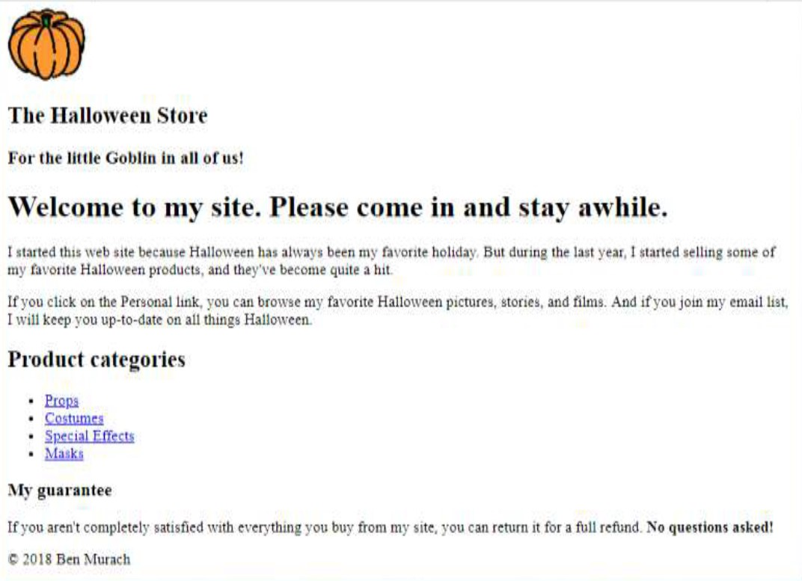

# Halloween Project - Chapter 3 

## Directions

### Partner 1
- Set "Halloween Store" as the title.
- Add the following HTML5 semantic tags as parent elements to the following lines:
  - header (lines 11-15)
  - main (lines 16-32)
  - footer (lines 33-35)
- Add an image of a pumpkin above "The Halloween Store" text.
  - You'll find the image in the images folder. 
- Add two levels of headings to the header. 
  - h2, "The Halloween Store"
  - h3, "For the little Goblin in all of us!"
- In the footer, use a character entity for the copyright symbol.
- In the footer, use JavaScript to automatically generate the current year.
- Add both partners names

### Partner 2
- Add three levels of headings and the paragraph text for the main content.
  - h1, "Welcome to my site. Please come in and stay awhile."
  - p, "I start this...quite a hit"
  - h2, "Product categories"
  - p, "If you click...all things Halloween"
  - h3, "My guarantee" 
  - p, "If you aren't...No questions asked!"
- Boldface the last sentence of the guarantee, "No questions asked!".
- Code the product categories as an unordered list 
- Code the product categories with relative links to other pages.
  - Props, "products/props.html"
  - Costumes, "products/costumes.html"
  - Special Effects, "products/special.html"
  - Masks, "products/masks.html"
- Run the code through the [HTML validator](https://validator.w3.org/). Fix any errors or warnings. 
- Send a link of the live website for grading.
  - The link will look like this:  

## Goal

